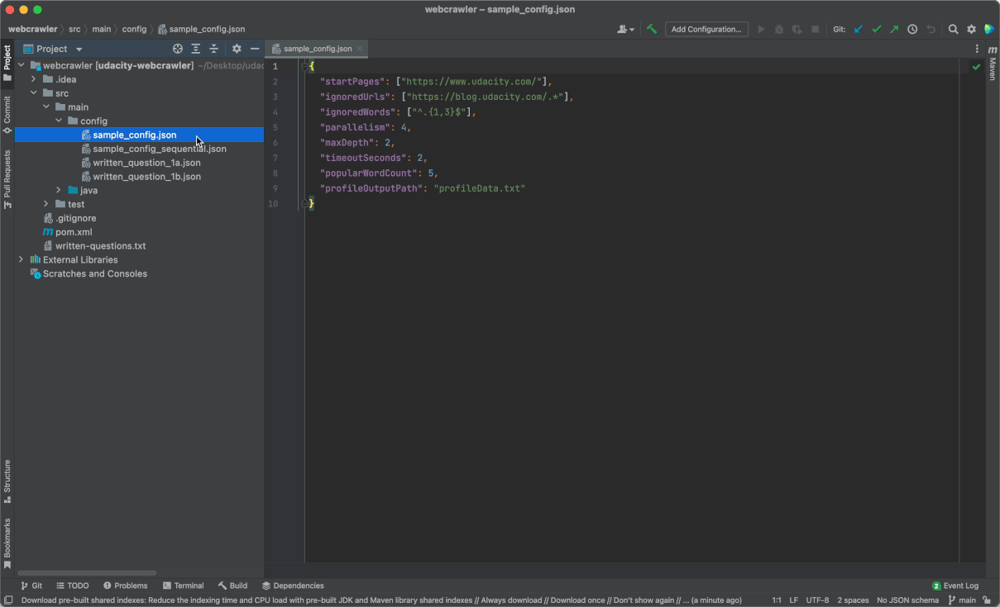

# UdaciSearch - parallel web crawler

Real-world project from [Java Programming Nanodegree](https://www.udacity.com/course/java-programming-nanodegree--nd079) at Udacity.

UdaciSearch is used for figuring out popular search terms on the internet in order to improve the SEO of the clients.

The crawler will read configuration from a JSON file, download and parse multiple HTML documents in parallel, and record popular web terms in an output file.

Also, A method profiling tool is built to measure the efficiency of the crawler and prove the benefits of the parallel crawler.

## Summary

- [Demo](#demo)
- [Skills](#skills)
- [Dependencies](#dependencies)
- [Usage](#usage)
- [Configuration](#configuration)
- [Output](#output)
- [License](#license)

## Demo



## Skills

- I/O
- Serialization
- Functional Programming
- Concurrent programming
- Reflection
- Dependency Injection
- Design Patterns

## Dependencies

- [jsoup](https://jsoup.org/) - An open-source Java library for working with HTML.
- [Jackson Project](https://github.com/FasterXML/jackson) - Affectionately known as "the best JSON parser for Java".
- [Guice](https://github.com/google/guice/) - An open-source dependency injection framework for Java.
- [Maven](https://maven.apache.org/) - Used to build and manage the project dependencies.
- [JUnit 5](https://junit.org/junit5/) - An open-source unit testing framework for Java.
- [Truth](https://github.com/google/truth) - An open-source assertion framework used in Java unit tests.

## Usage

1. In the ```root``` directory:
```
$ git clone https://github.com/Foystor/udacisearch-parallel-web-crawler.git
```
2. Get to the ```webcrawler``` directory:
```
$ cd udacisearch-parallel-web-crawler/webcrawler/
```
3. Run the web crawler and get the output:
```
$ mvn package
  java -classpath target/udacity-webcrawler-1.0.jar \
    com.udacity.webcrawler.main.WebCrawlerMain \
    src/main/config/sample_config.json
```

To see different results, You can change the starting pages in ```src/main/config/sample_config.json``` and run it again.

## Configuration

The web crawler app reads in a JSON file to determine how it should run.

Here is an example of such a file:

```
{
  "startPages": ["http://example.com", "http://example.com/foo"],
  "ignoredUrls": ["http://example\\.com/.*"],
  "ignoredWords": ["^.{1,3}$"],
  "parallelism": 4,
  "implementationOverride": "com.udacity.webcrawler.SequentialWebCrawler",
  "maxDepth": 10,
  "timeoutSeconds": 2,
  "popularWordCount": 3,
  "profileOutputPath": "profileData.txt"
  "resultPath": "crawlResults.json"
}
```

- ```startPages``` - These URLs are the starting point of the web crawl.
- ```ignoredUrls``` - A list of regular expressions defining which, if any, URLs should not be followed by the web crawler. In this example, the second starting page will be ignored.
- ```ignoredWords``` - A list of regular expressions defining which words, if any, should not be counted toward the popular word count. In this example, words with 3 or fewer characters are ignored.
- ```parallelism``` - The desired parallelism that should be used for the web crawl. If set to 1, the legacy crawler should be used. If less than 1, parallelism should default to the number of cores on the system.
- ```implementationOverride``` - An explicit override for which web crawler implementation should be used for this crawl. In this example, the legacy crawler will always be used, regardless of the value of the "parallelism" option.

If this option is empty or unset, the "parallelism" option will be used (instead of the "implementationOverride" option) to determine which crawler to use. If this option is set to a non-empty string that is not the fully-qualified name of a class that implements the WebCrawler interface, the crawler will immediately fail.
- ```maxDepth``` - The max depth of the crawl. The "depth" of a crawl is the maximum number of links the crawler is allowed to follow from the starting pages before it must stop. This option can be used to limit how far the crawler drifts from the starting URLs, or can be set to a very high number if that doesn't matter.
- ```timeoutSeconds``` - The max amount of time the crawler is allowed to run, in seconds. Once this amount of time has been reached, the crawler will finish processing any HTML it has already downloaded, but it is not allowed to download any more HTML or follow any more hyperlinks.
- ```popularWordCount``` - The number of popular words to record in the output. In this example, the 3 most frequent words will be recorded. If there is a tie in the top 3, word length is used as a tiebreaker, with longer words taking preference. If the words are the same length, words that come first alphabetically get ranked higher.
- ```profileOutputPath``` - Path to the output file where performance data for this web crawl should be written. If there is already a file at that path, the new data should be appended. If this option is empty or unset, the profile data should be printed to standard output.
- ```resultPath``` - Path where the web crawl result JSON should be written. If a file already exists at that path, it should be overwritten. If this option is empty or unset, the result should be printed to standard output.

## Output

The web crawler app prints the results to a JSON file using this format:

```
{
  "wordCounts": {
    "foo": 54,
    "bar": 23,
    "baz": 14
  },
  "urlsVisited": 12
}
```

- ```wordCounts``` - The mapping of popular words. Each key is a word that was encountered during the web crawl, and each value is the total number of times a word was seen.

When computing these counts for a given crawl, results from the same page are never counted twice.

The size of the returned map should be the same as the "popularWordCount" option in the crawler configuration. For example, if "popularWordCount" is 3, only the top 3 most frequent words are returned.

The keys and values should be sorted so that the more frequent words come first. If multiple words have the same frequency, prefer longer words rank higher. If multiple words have the same frequency and length, use alphabetical order to break ties (the word that comes first in the alphabet ranks higher).

- ```urlsVisited``` - The number of distinct URLs the web crawler visited.

A URL is considered "visited" if the web crawler attempted to crawl that URL, even if the HTTP request to download the page returned an error.

When computing this value for a given crawl, the same URL is never counted twice.

## License

[MIT License](LICENSE)
